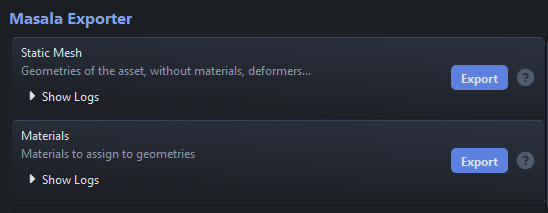
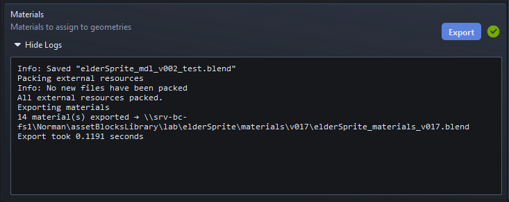
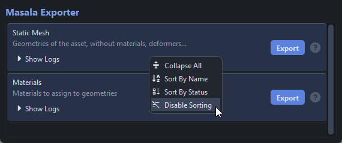
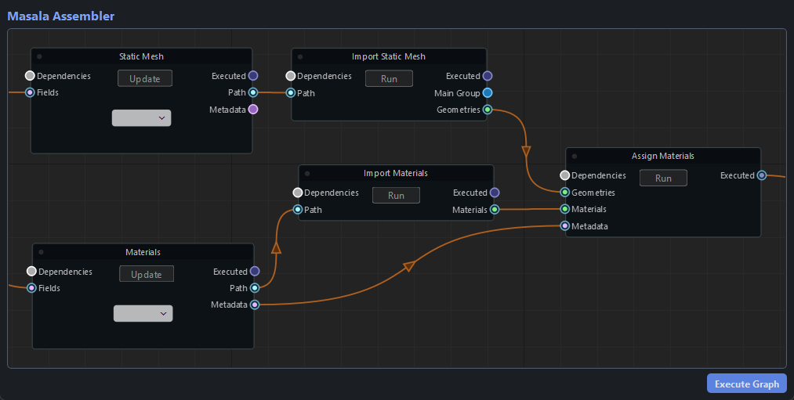
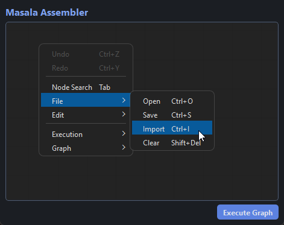
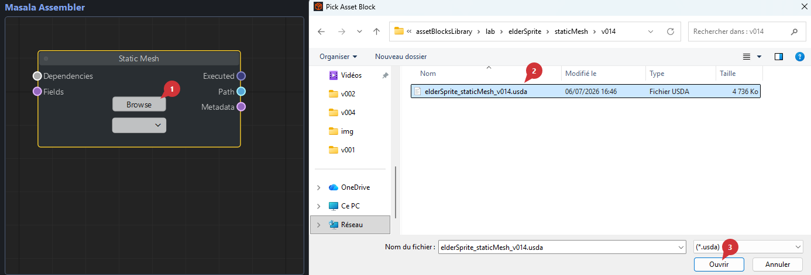
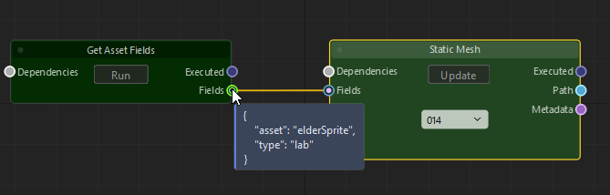
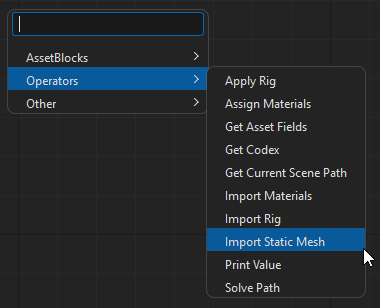
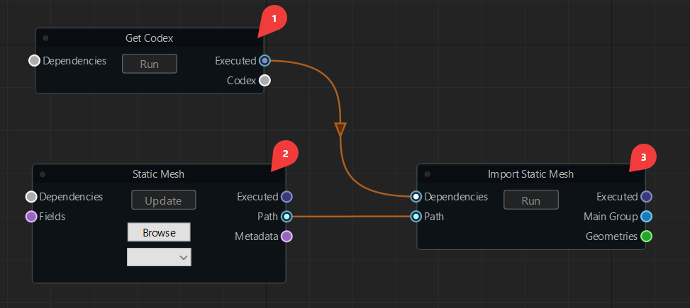

# Tools

## Masala Exporter

Masala Exporter is really straighforward: select the Exporters you want to execute and click `Export`.

!!! tip
    The Exporter Area has an expanded selection mode, so the following shortcuts are available.

    - `Ctrl` + `click` -> additive selection
    - `Shift` + `click` -> contiguous selection
    - `Ctrl` + `A` -> Select all
    - `Shift` + `up/down arrow` -> Extend selection up/down
    - `Ctrl` + `Space` -> Unselect last selected item

### Logs

You can inspect the logs of each Exporter individually by clicking on the `Show Logs`

### Additional Options

A few additional options can be accessed by right-clicking the Exporters Area.

## Masala Assembler

Masala Assembler is a node graph that describes the steps that must be taken to obtain the desired result.
Keep in mind the end result may not always be a finalized asset, as you can also write Recipes to create:

- asset variations
- levels of detail
- representations for validation
- asset debugging workflows
- the list goes on...

### Navigation

- `Middle Click` -> `Move`
- `Mouse Wheel` -> `Zoom In / Zoom Out`
- `Click` -> `Select Node`
- `Shift + Click` -> `Add Node To Selection`

### Actions

You can access all available actions (and see their shortcut) by right-clicking the node graph area.

### AssetBlock Nodes

Pressing `Tab` shows the Node Search. From there, you can access all AssetBlocks under the `AssetBlocks` submenu, or search them by name.

There are two ways of getting your AssetBlock file : 

- By manually picking the desired file using the `Browse` button

    

- By providing fields the allow Lucent to automatically find files matching the AssetBlock's naming convention

    

### Operators

Similarly to AssetBlocks, press `Tab` to show the Node Search. From there, you can access all Operators under the `Operators` submenu, or search them by name.

### Executing Nodes

To execute the entire graph, you can press the `Execute Graph` button or press `Ctrl + Shift + E`

If you need more fine tune control over what is executed, you can:

- Evaluate Selected Nodes (meaning "execute selected nodes and their parents") by pressing `Ctrl + E`
- Run Single Nodes by clicking on the `Run Button` or by pressing `Ctrl + R`

#### About Node Graph Order Evaluation

The order in which Operators are executed depends on their connections: if any of `Operator1` output plug is connected to any of `Operator2` input plug, then `Operator2` cannot run until `Operator1` has been executed.

Evaluating the entire graph or a node selection automatically computes the order in which operators should run. 

You can enforce evaluation order by using the `Dependencies` input plug of Operator nodes.

!!! tip "In this example, Operator :three: needs both Operators :one: and :two: before being able to be executed"

    