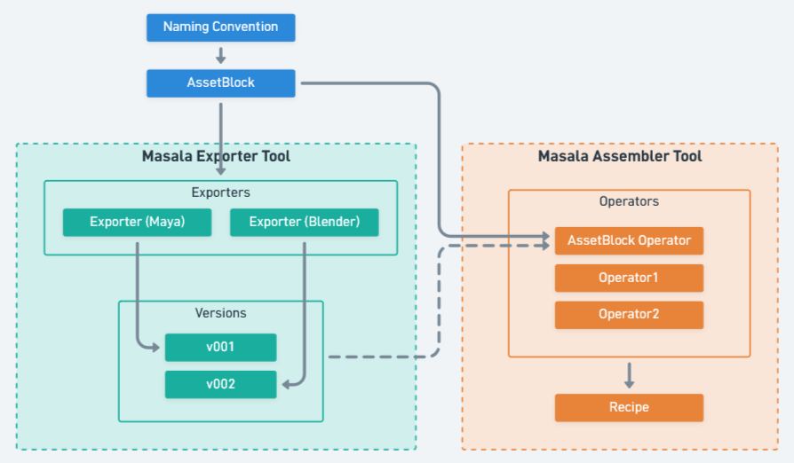
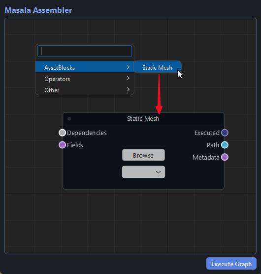
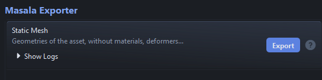
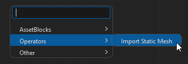
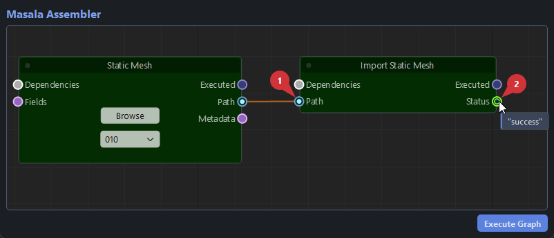
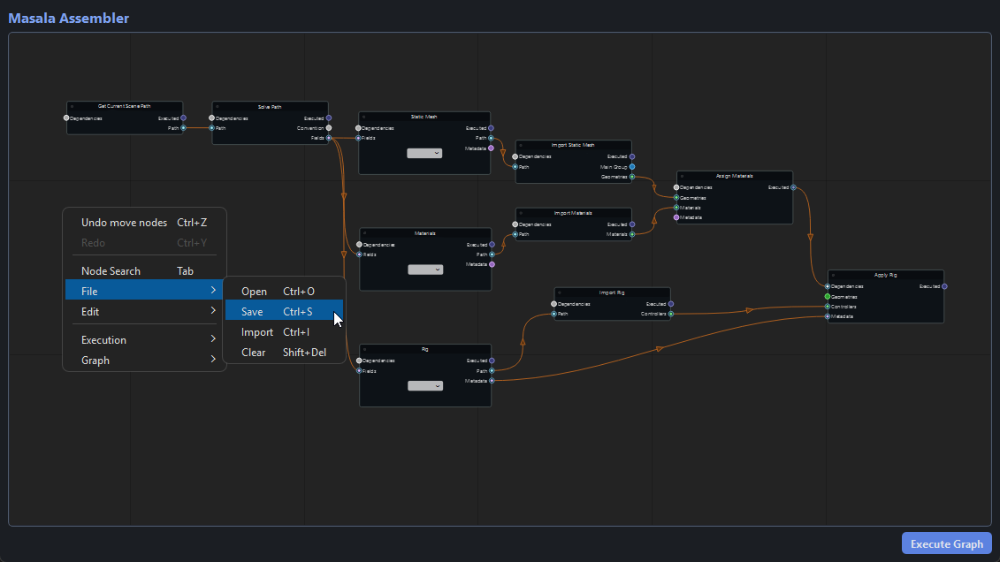

# Usage

Configuring Masala for your project involves the following steps:

- Defining naming conventions for AssetBlocks
- Registering AssetBlocks
- Creating Exporters for each AssetBlock
- Creating Assembly Operators to specify how AssetBlocks are imported and combined
- Saving node graphs that act as Recipes for your end products

Here is a representation of how each concept connects to the others.



!!! tip
    This documentation teaches you how to create AssetBlocks "in a vacuum", but you will most likely have to perform these steps in the context of a specific DCC. Keep in mind that everything you do here must be integrated into a Masala DCC implementation, as explained in [Masala DCC Implementations](./dccs.md).

## Configuration Structure

Masala's configuration is actually a Python package, so you can store framework objects in separate files and bind everything together in key configuration modules.


!!! success "Here is the recommended folder structure:"
    - :open_file_folder: masala_configuration_package :small_blue_diamond:
        - :open_file_folder: assetblocks
            - :memo: staticmesh.py
        - :open_file_folder: exporters
            - :open_file_folder: dcc_name
                - :memo: staticmesh_exporter.py
        - :open_file_folder: operators
            - :open_file_folder: dcc_name
                - :memo: staticmesh_importer.py
        - :memo: \_\_init\_\_.py :small_orange_diamond:
        - :memo: assetblocks_config.py :small_orange_diamond:
        - :memo: codex_config.py :small_orange_diamond:
        - :memo: exporters_config_dcc_name.py :small_blue_diamond:
        - :memo: operators_config_dcc_name.py :small_blue_diamond:
        - :memo: recipes_config.py

    !!! warning ""
        **Folders and files annotated with a :small_orange_diamond: are mandatory and must be named exactly like this.**  
        **Folders and files annotated with a :small_blue_diamond: are mandatory but their name is up to you.**

    !!! note ""
        As this configuration folder will be imported as a package, it is recommended to use relative imports such as

        ```python
        from .codex_config import codex
        ```

### Testing Your Configuration

While following this documentation, you can open Masala Exporter or Masala Assembler to verify your configuration.

=== "Masala Exporter"
    ```python
    from masala.exporter import show_exporter_dialog, get_exporters_config_from_path

    exporters = get_exporters_config_from_path("path/to/exporters_config_dcc_name.py")
    show_exporter_dialog(exporters)
    ```

=== "Masala Assembler"
    ```python
    from masala.assembler import show_assembler_dialog, get_assembler_config_from_path

    assetblocks, operators = get_assembler_config_from_path("path/to/operators_config_dcc_name.py")
    show_assembler_dialog(assetblocks, operators)
    ```

Alternatively, you can set the `MASALA_EXPORTERS_CONFIG` and `MASALA_OPERATORS_CONFIG` environment variables to the paths of your configuration files.

=== "Masala Exporter"
    ```python
    import os
    from masala.exporter import show_exporter_dialog

    os.environ["MASALA_EXPORTERS_CONFIG"] = "path/to/exporters_config.py"
    show_exporter_dialog()
    ```

=== "Masala Assembler"
    ```python
    import os
    from masala.assembler import show_assembler_dialog

    os.environ["MASALA_OPERATORS_CONFIG"] = "path/to/operators_config.py"
    show_assembler_dialog()
    ```

## Naming Conventions

Masala uses the Python package [Lucent](https://pypi.org/project/lucent-codex/) to define where AssetBlocks should be stored.
For more information, see the [Lucent official documentation](https://tristanlanguebien.github.io/lucent/)

In Lucent, naming conventions are registered in a `Codex` object with `Rules` (regular expressions that fields must follow) and `Conventions` (templates for paths).

Here is a minimal example of how to set up a few AssetBlock naming conventions.

=== ":memo: ./codex_config.py"
    ```python
    from lucent import Codex, Convention, Conventions, Rule, Rules


    class MasalaRules(Rules):
        default = Rule(r"[a-zA-Z0-9]+")
        extension = Rule(r"[a-zA-Z0-9]+", examples=["mp3", "png", "mov"])
        asset = Rule(r"([a-z]+)([A-Z][a-z]*)*", examples=["redApple", "philip", "chair"])
        assetBlockType = Rule(r"[a-zA-Z]+", examples=["staticMesh", "materials", "rig"])
        task = Rule(r"[a-zA-Z0-9]+", examples=["mdl", "rig", "surf"])
        version = Rule(r"\d{3}", examples=["001", "002", "003"])


    class MasalaConventions(Conventions):
        project_root = Convention("C:/myProject")
        # First, we define a generic template for all AssetBlocks
        assetblock = Convention(
            "{@project_root}/AssetBlockLibrary/{asset}/{assetBlockType}/{asset}_{assetBlockType}_v{version}.{extension}"
        )
        # The Static Mesh AssetBlock is defined from the assetblock convention,
        # with assetBlockType set to "staticMesh" and extension set to "usda".
        assetblock_staticmesh = Convention(
            "{@assetblock}", fixed_fields={"assetBlockType": "staticMesh", "extension": "usda"}
        )
        # From there, you can add as many AssetBlock Conventions as you like.
        assetblock_materials = Convention(
            "{@assetblock}", fixed_fields={"assetBlockType": "materials", "extension": "blend"}
        )

        # Another important part is to register workfile naming conventions
        # so they can be parsed to generate output paths automatically.
        workfile = Convention(
            "{@project_root}/assetWorkspace/{asset}/{task}/{asset}_{task}_v{version}.{extension}"
        )

    class MasalaCodex(Codex):
        convs: MasalaConventions = MasalaConventions()
        rules: MasalaRules = MasalaRules()

    codex = MasalaCodex()
    ```

!!! success "The Codex object created at the end will be used to validate and generate all paths related to AssetBlocks"

    !!! warning "It is important to create a variable named exactly `codex` that contains the `Codex` instance."

## AssetBlocks

### Creating an AssetBlock

Now that Masala knows where AssetBlocks are stored, we can feed the Convention into an AssetBlock object.

=== ":memo: ./assetblocks/staticmesh.py"
    ```python
    from masala import AssetBlock
    from ..codex_config import codex

    staticmesh = AssetBlock(
        name="StaticMesh",
        label="Static Mesh",
        description="Geometries of the asset, without materials, deformers...",
        convention=codex.convs.assetblock_staticmesh,
    )
    ```

### Registering AssetBlocks

Once your AssetBlocks are ready, register them in a single configuration file.

=== ":memo: ./assetblocks_config.py"
    ```python
    from .assetblocks.materials import materials
    from .assetblocks.rig import rig
    from .assetblocks.staticmesh import staticmesh

    assetblocks = [staticmesh, materials, rig]
    ```

!!! warning "It is important to create a variable named exactly `assetblocks` that contains a list of `AssetBlock` instances."

!!! success "These AssetBlock objects will later be used as a shared base for exporters and importers"

    When your AssetBlocks are registered, they will appear among the available AssetBlocks in the Masala Assembler Tool.

    

    This node is only used to detect the available versions. The [export](#creating-an-exporter)/[import](#creating-operators) logic is detailed later in this documentation.


## Exporters

### Creating an Exporter

Exporting an AssetBlock consists of four steps:

1. Identifying the path of the current scene.
2. Parsing the current scene's path to generate a destination path.
3. Executing a function that performs the export itself.
4. Writing metadata to a `.abmd` file stored next to the exported file (`.abmd` stands for "AssetBlockMetaData").

These steps are encapsulated into an Exporter object.

=== ":memo: ./exporters/dcc_name/staticmesh_exporter.py"
    ```python
    from pathlib import Path
    from masala import Exporter
    from ...assetblocks.staticmesh import staticmesh

    def get_current_path() -> Path:
        return Path("C:/myProject/assetWorkspace/myAsset/mdl/myAsset_mdl_v001.blend")

    def export(path: Path):
        print(f"Writing placeholder file to {path}")
        path.parent.mkdir(exist_ok=True, parents=True)
        path.write_text("placeholder")
        return {"status": "success"}

    def extra_metadata() -> dict:
        return {"extra data": "hello world"}


    staticmesh_exporter = Exporter(
        assetblock=staticmesh,
        current_path_callback=get_current_path,
        export_callback=export,
        metadata_callback=extra_metadata,
    )
    ```

!!! tip "As stated earlier, an AssetBlock can have multiple exporters. For example, your asset pipeline may allow artists to generate a mesh from both Maya and Blender."


### About Metadata

An exporter will always create a `.abmd` file containing a few default pieces of information saved in JSON format (time of the export, author, computer name...).

In addition to this generic data:

- the `export_callback` may return a `dict` with extra data collected during the export process.
- an optional `metadata_callback` can be provided to the exporter.


### Registering Exporters

Once your Exporters are ready, register them in a single configuration file.

=== ":memo: ./exporters_config_dcc_name.py"
    ```python
    from .exporters.dcc_name.materials_exporter import materials_exporter
    from .exporters.dcc_name.staticmesh_exporter import staticmesh_exporter

    exporters = [staticmesh_exporter, materials_exporter]
    ```

!!! success "This configuration file is designed to be passed to [DCC Integration](dccs.md) preferences. When running the Masala Exporter Tool, your newly registered AssetBlock Exporters should show up."
    
    


## Operators

### Creating Operators

We now need to create `Operators`, which are nodes that execute a function and can receive data such as the AssetBlock path or metadata. The most obvious ones are Operators that import AssetBlocks, but you can create nodes for all steps of the asset assembly pipeline.

Let's see how to create an Operator that imports the selected version of an AssetBlock:

=== ":memo: ./operators/dcc_name/staticmesh_importer.py"
    ```python
    from pathlib import Path
    from masala import Input, Operator, Output


    def callback(path: Path) -> list:
        print(f"IMPORTING {path}")
        return ["success"]


    import_staticmesh = Operator(
        name="StaticMeshImport",
        label="Import Static Mesh",
        callback=callback,
        inputs=[
            Input(
                kwarg="path",  # Indicates that the input's value will be passed to the "path" argument of the callback
                label="Path",
                typ=Path,
                mandatory=True,
            )
        ],
        outputs=[Output(label="Status", typ=str)],
    )
    ```

### Registering Operators

Once your Operators are ready, register them in a single configuration file.

=== ":memo: ./operators_config_dcc_name.py"
    ```python
    from .operators.dcc_name.materials_importer import materials_importer
    from .operators.dcc_name.staticmesh_importer import staticmesh_importer

    operators = [staticmesh_importer, materials_importer]
    ```

!!! success "This configuration file is designed to be passed to [DCC Integration](dccs.md) preferences. When running the Masala Assembler Tool, your newly registered Operators should show up."
    
    

    As you can see, the AssetBlock path can be plugged into the "Path" input plug, and the result appears in the "Status" output plug.

    

### About Inputs and Outputs

!!! tip
    Inputs have type validation: in this case, you won't be able to plug an integer into the Path input. If you want to be more permissive (for example, to allow both `str` and `Path` objects), set `typ` to `typing.Any`.

!!! tip
    You may have noticed that the import callback we wrote returns a list: each item in the list goes to a corresponding output port. If you have three output ports, your function should return a list containing three objects.

!!! tip
    By default, all Operators include a `Dependencies` input plug, used to indicate nodes that should be executed before the Operator runs. This plug does not pass any values around, it only fine-tunes evaluation order.

!!! tip
    By default, all Operators include an `Executed` output plug that returns either `True` or `False`.

## Recipes

Masala Assembler allows you to save your node graphs in JSON format so they can be loaded or imported. Within a Recipe Library, these files become your main way of sharing an asset pipeline across a team.



You can create an optional configuration file to define the default path where recipes are saved. If this file is not provided, users must browse to a destination folder.

=== ":memo: ./recipes_config.py"
    ```python
    from pathlib import Path

    recipes = Path.home().joinpath("masala_recipes")
    ```

!!! warning "It is important to create a variable named exactly `recipes` that contains a `Path` or `str` object."

## Done!

:rocket: Congratulations, you now have all the keys to create as many AssetBlocks, Exporters, Operators, and Recipes as you like. With a little creativity, you can use Masala to build the asset pipeline that fits your needs.

---

!!! info ""
    <a href="Next Section"> <div style="text-align: right; font-weight: bold"> [Next Section : Tools](./tools.md) </div>